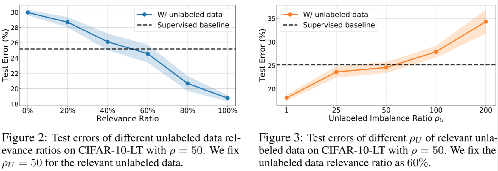
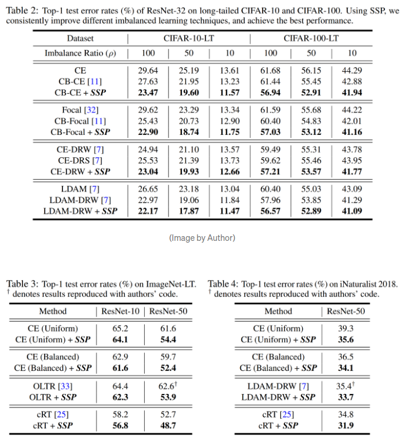
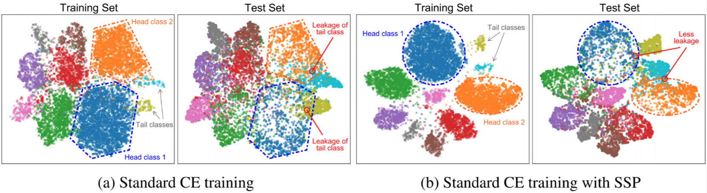

# Struggling with data imbalance? Semi-supervised & Self-supervised learning help!
[[Article]](https://towardsdatascience.com/struggling-with-data-imbalance-semi-supervised-self-supervised-learning-help-4de8b8f23490)

---
## 개요

- NIPS2020에 소개된 논문 [Rethinking the Value of Labels for Improving Class-Imbalanced Learning](https://arxiv.org/abs/2006.07529)
- 학습 데이터의 불균형에 따른 분류 문제에 대해 연구
- 이론적 모델링과 다양한 학습을 통해, Semi-suprevised & Self-supervised 학습이 불균형한 학습 데이터에서도 성능을 향상시키는 것을 확인

- Semi-supervised learning?
  - 학습 데이터에 unlabeled 데이터를 더 사용하는 것
- Self-supervissed learning?
  - 추가 데이터 없음. label 정보를 사용하지 않고, self-suprevised pre-training을 먼저 진행하는 방법

---

## Background

- real-world 환경에서 매우 많이 발생하는 문제점
  - 실제 학습 데이터는 각 카테고리마다 동일한 분포의 데이터를 갖고 있지 않음
  - 카테고리에서 학습 데이터의 양에 따라 정렬을 하면 "long tail" 효과를 관찰할 수 있음

- 이 문제는 classification 분야 뿐만이 아니라, detection, segmentation 분야의 데이터셋에서도 많이 발생
- 또한, 자율 주행, 의료 영상(암 발견 유무)등의 데이터는 본질적으로 밸런스가 맞지 않음
  - 정상(건강한)인 경우의 데이터는 많이 췩득할 수 있지만, 비정상(암 발생)인 경우 데이터는 정상에 비하여 적을 수 밖에 없음

- **데이터의 불균형이 왜 문제일까?**
  - 위 처럼 불균형적이 데이터로 학습을 진행하면 모델은 major 클래스에 대해서는 잘 학습하지만, 적은 데이터인 minor 클래스에 대해서는 일반화하지 못함

- 데이터 불균형 문제를 해결하기 위한 방법들

| 방법 | 내용 |
|---|---|
| Re-sampling | major 샘플은 덜 사용(under-sampling)하고, minor 샘플을 더 사용(over-sampling)하는 방법. 하지만 over-sampling은 일반화를 잘하기 보다는 minor 샘플에 overfit 될 수 있음. 또한 under-sampling은 정보의 손실을 야기함 |
| Synthetic samples | 가상의 minor 샘플을 생성하여 사용하는 방법. classic한 방법으로는 SMOTE 방법으로, randomly 하게 선택된 minor 샘플과 KNN방법을 이용하여 주변의 샘플을 선택하고 linear interpolation을 통해 새로운 샘플 생성 |
| Re-weighting | 서로 다른 카테고리는 서로 다른 weight를 적용. 가장 간단하게는 (전체 샘플 수 / 카테고리에 속한 샘플 수)를 가중치로 사용 |
| Transfer learning | major 클래스와 minor 클래스르 분리하여 학습 진행 |
| Metric learning | minor 클래스의 주변 경계 및 margin을 잘 모델링 하기를 기대하는 방법 |
| Meta learning/domain adaptation | major, minor의 데이터에 adaptive한 re-weight를 다르게 처리하거나, domain adaptation로 재정의 하여 문제 해결하는 방법 |

---

## Our motivation and ideas

- unsupervised learning보다 Label을 이용한 supervised learning의 정확도가 더 높게 나타남 (긍정적 측면)
- 불균형한 데이터 분포에서는 major 클래스 방향으로 label bias가 발생(부정적 측면)
- 위의 결과에서 imbalanced label은 양날의 검으로 표현할 수 있음 -> 클래스 불균형 학습을 개선하기 위해 레이블의 가치를 최대한 활용하는 방법은 무엇일까?
- 두가지 관점에서 분석
  - 긍정적 측면
    - Label의 정보는 매우 중요함. -> unlabeled 데이터가 더 많으면 기존의 Label을 활용하여 Semi-supervised learning로 unlabeled 데이터만 이용한 모델보다 정확도를 향상시킬 수 있음
  - 부정적 측면
    - 불균형한 데이터는 label bias를 발생시킴 -> 따라서, 첫 학습시에 label을 사용하지 않고 self-supervised pre-training 진행

---

## Imbalanced learning with unlabeled data

- 간단한 모델을 이용하여 불균형한 데이터와 extra 데이터가 전체 학습 진행에 미치는 영향을 확인
- 가설
  - 불균형한 데이터로 학습한 기본 모델로 extra 데이터의 label을 지정할 수 있다. -> 여기서 얻은 unlabeled data의 분포도 불균형할 것임 -> 이 데이터를 학습에 추가 데이터로 사용하면 성능 향상 가능

### 논문의 수식에 따르면

1. Training data imabalance를 estimation의 정확도에 영향을 준다.
  - 즉, imbalance 정도가 estimation에 영향을 준다.
2. unlabeled data의 imbalanced 정도는 good estimation을 얻을 확률에 영향을 준다.
  - 이때, unlabeled data가 balanced인 경우 good estimation을 확률이 증가한다.
  - 그러나 unlabeled data가 balanced하지 않더라도 어찌되었든 imbalanced data를 추론하는 것에는 도움이 된다.

### Semi-supervised imbalanced learning framework

1. 불균형한 데이터를 이용하여 초기 모델 학습
2. unlabeled 데이터에 초기 모델을 적용하여 pseudo label 할당
3. 위 두 데이터를 결합하여, joint loss function을 최소화하는 최종 모델 학습

### Experiments

- CIFAR-10, SVHN 데이터셋을 인위적으로 불균형하게 생성
  - CIFAR-10의 경우 CIFAR-10에 유사한 Tiny-imagenet class data를 unlabel data로 사용
  - SVHN의 경우 extra SVHN dataset을 unlabeled dataset으로 사용
- Unlabeled 데이터는 여러 분포를 비교 실험 테스트

- 실험 결과

  - 데이터셋, imbalanced ratio of labeled data, imbalanced ratio of unlabeled data 등이 달라도 일관성 있는 성능 향상을 보여줌
  - imbalanced learning method의 SOTA 방법인 LDAM-DRW를 적용하면 CE를 사용한 것 보다 성능 향상

  - 위 그림을 보면 unlabeled data를 사용한 것이 경계 영역이 더 명확히 분리된 것을 확인할 수 있음
    - 특히 minor class 부분의 경계 부분이 이전보다 훨씬 더 잘 분리됨
  - 기존의 minor class의 경우 분포가 적어 경계가 모호하고, 일반화가 잘 안되었지만, unlabeled data가 이러한 minor class의 밀도를 높여주고, regularizer를 강하게 적용하면 모델의 경계를 더 잘 나눌 수 있음

---

## Further thoughts on semi-supervised imbalanced learning

### Unlabeled 데이터와 기존 학습 데이터와의 관련성
- unlabeled 데이터 중에서 기존 학습 데이터의 카테고리에 속하지 않은 데이터들의 경우, 이 부정확한 정보들은 학습결과에 안좋은 영향을 미침
  - 위 문제를 확인하기위해, unlabeled 데이터와 기존 학습 데이터의 관련성을 조절하여(unlabeled 데이터에 학습데이터의 label과 같은 영상을 얼마나 포함했는지를 변경한 것으로 보임) 테스트 -> Fig.2
- 의료 데이터에서 실제 질병에 대한 데이터는 1% 정도밖에 되지 않으므로, unlabeled 데이터를 수집한다 하더라도 질병에 대한 데이터는 매우 적음
  - unlabeled 데이터의 연관성은 60%로 고정하고, 불균형도를 조절하여 불균형도가 학습에 얼마나 영향을 미치는지 테스트 -> Fig.3

- 위와 같은 문제는 일반적인 상황에서도 많이 발생할 수 있는 문제이며, 그러므로 semi-supervised 학습이 어려운 극단적인 경우에는 다른 효과적인 방법이 필요 -> Self-supervised 학습

---

## Imbalanced learning from self-supervision

- Self-supervied 학습의 테스트 결과 아래의 결과 도출
  - 높은 확률로 self-supervied 학습으로 좋은 모델을 획득할 수 있었음. feature domain에서 오류도 감소
  - 학습 데이터의 불균형도는 좋은 모델을 생성하는데 영향을 미침

### Self-supervised imbalanced learning framework

1. label bias 문제를 극복하기 위해, 첫 스테이지에서 label 정보를 제외하고 self-supervised 학습을 진행하는데 이를 self-supervied pre-training(SSP)로 정의
  - 이 프로세스는 불균형한 데이터에서 Label 상관없이, 더 나은 초기화 및 데이터의 특징을 학습하는 것을 목표로 함
2. SSP를 수행한 후에는 기존과 같은 방법으로 학습 진행
  - SSP는 기존 방법과 연관성이 없으므로, 데이터가 불균형한 기존의 모든 알고리즘에 적용 가능

### Experiments

- 추가적인 데이터는 사용하지 않음
- Long-tailed CIFAR-10/100, ImageNet-LT, iNaturalist 데이터셋 사용
- Self-supervied 학습에는 classic Rotation prediction, MoCo 방법 사용 (추가적인 Appendix에서는 4개의 서로 다른 Self-suprevied 알고리즘으로 테스트)
- 데이터의 불균형도와 학습 알고리즘을 변경하며 실험

- Self-supervied의 효과를 확인하기위해 t-SNE를 통해 살펴보면

- 일반적인 학습 결과는 Head 클래스의 Decision boundary가 큰 부분을 차지하고 있고, minor 클래스들과의 boundary가 명확하게 구분되지 않는 것을 볼 수있음 -> 일반화되지 않음
- SSP를 적용하면 Major와 Minor 클래스들간의 공간을 확보(데이터 공간의 구조를 학습)하여 클래스간의 decision boundary가 명확해지는 것을 볼 수 있음

---

## Summary

- Semi-supervised & Self-supervised 관점에서 불균형한 학습 데이터의 문제점을 해결할 수 있음을 확인
- 직관적인 분석을 통해 검증하였고, 일반적인 프레임워크들을 사용하여 다른 Task에 적용하기 쉬움