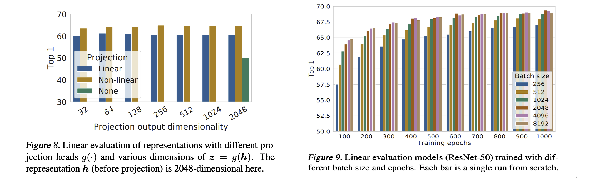

# SimCLR in PyTorch

- SimCLR(Simple Framework for Contrastive Learning of Visual Representations)
- Self-supervised learning의 SOTA 방법

## SimCLR contribution
- unsupervised learning는 강한 augmentation을 통해 이득을 얻음
- base encoder 이후에 학습 가능한 MLP를 도입하면 학습된 표현의 품질 향상
- contrastive cross-entropy loss 학습은 normalized embedding과 적절하게 조절된 파라미터에 이점을 얻음(?)
- Contrastive learning는 supervised learning에 비하여 더 큰 배치 사이즈와 더 긴 학습에 이점을 가짐. supervised learning와 마찬가지로, network이 deeper 및 wider할 수록 좋음

## SimCLR의 4가지 구성요소

### 1. stochastic data augmentation module 
- 주어진 데이터를 무작위로 변환하여 두개의 상관된 데이터로 변환하는 과정
- 같은 데이터에서 뽑았으면 positive pair, 다른 데이터에서 뽑았으면 negative pair로 간주
- 저자는 3개의 간단한 augmentation 적용: Random Cropping, Random Color Distortions, Random Gaussian Blur

### 2. base encoder f
- augmented 데이터로부터 특징 벡터를 추출하는 Network

### 3. small neural network projection head g
- Contrastive loss를 적용하기 위한 공간에 base encoder로 부터 나온 특징 벡터를 맵핑

### 4. Contrastive Loss function

## 알고리즘 및 실험 환경

- N개의 mini-batch에서 2N개의 augmented 데이터를 생성하고, 2(N-1) 개의 negative pair과 N개의 positive pair가 만들어짐
- 유사도 비교는 cosine similarity 사용
- loss는 위의 Contrastive Loss function 참조. temperature 파라미터 사용
- Batch size는 256 ~ 8192. 8192 batch size에서 negative pair은 16382
- 큰 batch size에서는 SGD, Momentum Optimizer가 제대로 작동하지 않아 LARS Optimizer 사용
- 128개의 TPUv3, ResNet-50, batch size=4096 100epoch로 학습할 때, 1.5시간 정도 걸림(CIFAR10)
- 분산 학습을 할 때, 각 디바이스에서의 평균과 분산을 이용하면 information leakage 가 발생할 수 있으므로, 전체 디바이스의 평균과 분산을 이용하여 학습

## Some Observations

### Augmentation 혼합
- 단일 augmentation만으로는 효과적인 표현의 학습이 안됨
- 특히 color distortion을 하지 않으면, 대부분의 패치는 비슷한 컬러 분포를 갖게되고 Network는 컬러분포만으로 이미지를 구분하도록 학습 됨

## 실험 결과

