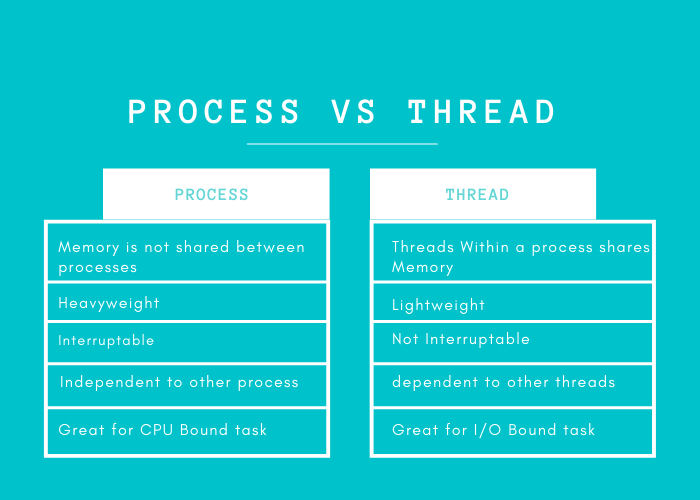

# 10 Advanced Python Concepts To Level Up Your Python Skills

## 1. Exception Handling

- Python에 약 30개의 내장 Exception이 존재
- try & except로 사용 가능. 여러개의 except 사용 가능
- try에 실행이 필요한 코드를 넣고, try 내의 코드에서 실행을 실패하면 해당 except 내의 코드 실행
- else: try 내의 코드가 성공적으로 실행되었을 때, 진행되는 코드
- finally: try 내의 코드의 실행이 성공, 실패 상관없이 진행되는 코드

```Python

import sys
try:
   f = open('myfile.txt') 
   s = f.readline()
   i = int(s.strip())
except OSError as err:
   print("OS error: {0}".format(err))
except ValueError:
   print("Could not convert data to an integer.")
except:
   print("Unexpected error:", sys.exc_info()[0])
   raise
finally:
   print("Operation Successfully Done!!")

```

## 2. Collections

### Counter
- 반복문이 실행되고 key가 요소이고 value가 발생한 횟수인 dictionary를 반환

```python

from collections import Counter
data = [1,1,1,1,2,3,4,3,3,5,6,7,7]
count = Counter(data)
print(count)

# output: Counter({1: 4, 3: 3, 7: 2, 2: 1, 4: 1, 5: 1, 6: 1})

```

- 추가 함수
  - elements(): 개수 반환
  - most_common(): tuple의 list형으로 Counter 반환
  - subtract: 해당 항목 제거 가능

### namedtuple
- tuple의 각 항목에 추가적인 이름 할당 가능한 tuple

```python

from collections import namedtuple
Direction = namedtuple('Direction','N,S,E,W')
dt = Direction(4,74,0,0)
print(dt)

# output: Direction(N=4, S=74, E=0, W=0)

```

### OrderedDict
- 삽입된 순서를 기억하는 dictionary

```python

from collections import OrderedDict
dictt = OrderedDict()
dictt['a'] = 5
dictt['d'] = 2
dictt['c'] = 1
dictt['b'] = 3
print(dictt)

# output: OrderedDict([('a', 5), ('d', 2), ('c', 1), ('b', 3)])

```

### defaultdict
- 존재하지 않는 key를 호출해도 키 오류 대신 기본값을 반환

```python

from collections import defaultdict
dictt = defaultdict(int)
dictt['a'] = 2
print(dictt['a'])  ## return the value
print(dictt['b'])  ## returns the default value

# output

2
0

```

### deque
- 요소를 양방향(앞, 뒤)에 추가 및 삭제할 수 있는 queue

## 3. itertools

- 다양한 iterator 함수 제공

|항목|내용|
|---|---|
|product(iterable,iterable)| 데카르트 곱 수행. iterable 여러개 가능 |
|permutation(iterable)| 반복되는 요소가 없는 모든 가능한 순서 |
|combinations(iterable,n)| 반복 없이 지정된 길이의 모든 가능한 조합. 여기서 n은 조합 튜플의 크기 |
|combinations_with_replacement(iterable,n)| 위와 비슷하나 중복 가능(자신이 또 뽑힐 수 있음) |
|accumulate(iterable)| 요소의 합 누적해가며 iterable |
|groupby(iterable,key=FUNC)| 각 key에 맞춰 분류하여 list로 반환. 단, 같은 키라도 분산되어있으면 한 그룹에 뭉쳐지지 않으므로 수행 전에 key의 정렬 필요 |

## 4. lambda

- 람다 표현식은 식 형태로 되어 있다고 해서 람다 표현식(lambda expression)이라고 부르며, 람다 표현식은 함수를 간편하게 작성할 수 있어서 다른 함수의 인수로 넣을 때 주로 사용

```python 

even_or_odd = lambda a: a%2==0
numbers = [1,2,3,4,5]
even = list(map(even_or_odd,numbers))
print(even)

# output: [False, True, False, True, False]

```

## 5. Decorators

- 기존 코드를 수정하지 않고 몇 가지 새로운 기능을 추가하는 파이썬의 기능
- function, class 두가지 유형 존재
- 이름 앞에 **@** 가 붙음

```python

import functools
def decorator(func):
    @functools.wraps(func)
    def wrapper(*args, **kwargs):
        a,b = args
        print(a*b)
        result = func(*args,**kwargs)
        print(a/b)
        return result
    return wrapper

@decorator
def add(x,y):
    return x+y
result = add(5,6)
print(result)

# output
30
0.8333333333333334
11

```

## 6. Generators

- yield를 포함하고 있는 함수 = Generator
- Generator는 요청할 때마다 하나의 항목만 생성하므로, 메모리를 효율적으로 사용 가능
- 대용량 파일을 불러오거나 할 때 사용

```python

def fibon(limit):
  a,b = 0,1
  while a < limit:
      yield a
      a, b = b, a + b

for x in fibon(10):
   print (x)

```

## 7. Threading and Multiprocessing



## 8. Dunder Methods

- 메서드 앞이나 뒤에 "__"가 붙어 있는 것들
- 매직 메소드
- 미리 정의되어 있는 특별한 이름을 가진 메소드들을 재정의 함으로써 파이썬 인터프리터가 데이터 객체를 만들거나, 표현하거나, 연산을 하는데 도움을 줄 수 있음

## 9. Logging

- logging 라이브러리 존재
- [자세한 내용](https://medium.com/pythoneers/aster-logging-in-python-73cd2ff4a7cb)

## 10. Context Managers

- 원할 때 리소스를 할당하고 해제 시킬 수 있음
- with 문
  - 파일 열고 닫는 코드에서 가장 많이 사용

```python

file = open('data.txt','w')
try:
  file.write("Hello")
except:
   file.close()

---------------------------------------------

with open ('data.txt','w') as f:
    f.write("Hello")

```

