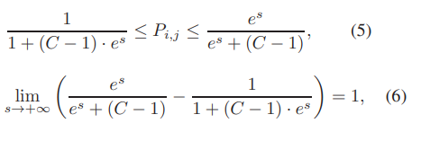
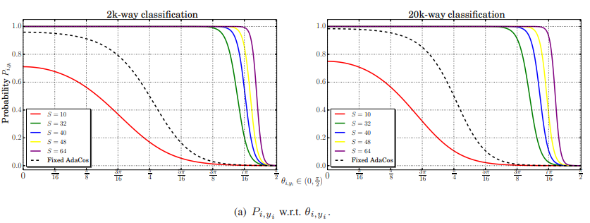
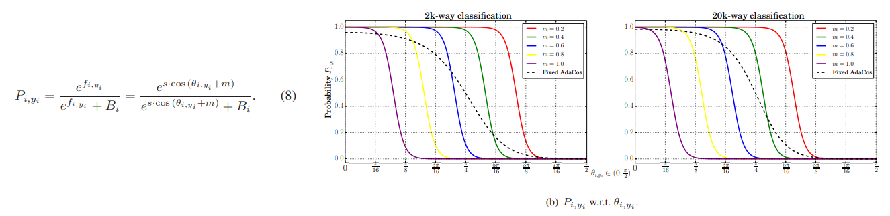
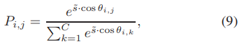
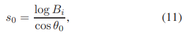
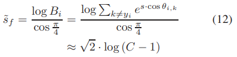
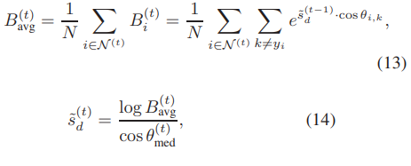

# AdaCos: Adaptively Scaling Cosine Logits for Effectively Learning Deep Face Representations

---

## Abstract
- cosine-based softmax loss는 face recognition에서 큰 발전을 보임
- 하지만 hyperparamter setting에 face recognition의 성능에 큰 영향을 끼침(optimization 하기 힘듦)
  - 사용자의 경험에 좌지우지됨
- 본 논문에서는 cosine-based softmax loss에서 이용되는 scale parameter(s)와 margin parameter(m)에 대해 분석하고, hyperparameter를 없애는 방법을 제시
  - hyperparameter를 없앰으로써 face recognition에서 stable하게 높은 high accuracy를 얻을 수 있음

---

## Introduction
- face verification(1:1) 및 face identification(1:N) 분야의 CNN 방법이 큰 발전을 함
  - 발전으로 이끌 수 있었던 3가지 요소
    - 많은 학습 데이터
    - DNN architecture
    - 효과적인 loss function
- 위 요소 중에서 loss function은 face recognition의 성능에 중요한 역할을 함
- Image classification 분야와 다르게 face recognition은 open-set problem
  - 이를 해결하깅 위해 대부분 face image를 통해 CNN을 활용하여 feature를 생성하고, feature 사이의 유사도를 측정하는 방식으로 접근
- softmax loss를 이용해 학습하고, cosine-similarity를 이용하는 방법은 별로 좋지 않음
  - 위의 갭을 해결하기 위해 cosine-based softmax losses 방법들이 대두됨(training & inference 모두 cosine-similarity를 활용)
- 하지만, cosine-based loss 방식들의 학습은 불안정함
  - hyperparameter에 영향을 많이 받음
- 본 논문에서는 cosine-based softmax loss들이 angular margin을 최대화 하는 부분을 집중적으로 살펴봄
  - 위 방식에서 여러개의 hyperparameter들이 있는데,  이것들은 성능에 상당한 영향을 미치며 튜닝하기 어려움
  - optimzation하기 위해서는 hyperparameter를 조정하며 여러번의 학습 시도가 필요
  - 서로 다른 hyperparameter들은 결과 확률을 조절하는데 비슷한 효과를 보임
  - 부적절한 hyperparameter는 잘못된 분류로 인해 loss가 optimization되기 힘든 상황을 야기
- AdaCos(Adaptive cosine-based loss function) 제안
  - hyperparameter의 자동화
  - 학습 샘플 & 학습 샘플의 클래스에 대응되는 center vector사이의 scale을 동적(dynamically)으로 조정함
  - 추가적인 computational cost 소모 없이 빠르고 안정적으로 convergence 가능

---

## Related Works
### Cosine similarities for inference
- 일반적으로 feature-normalized losses 방식 사용
- CoCo loss[20, 21] 및 NormFace[39]는 normalization의 효과 고찰 및 새로 만든 softmax loss & metric learning 제안
  - [20] Yu Liu, Hongyang Li, and Xiaogang Wang. Learning deep features via congenerous cosine loss for person recognition. arXiv preprint arXiv:1702.06890, 2017.
  - [21] Yu Liu, Hongyang Li, and Xiaogang Wang. Rethinking feature discrimination and polymerization for large-scale recognition. arXiv preprint arXiv:1710.00870, 2017.
  - [39] Feng Wang, Xiang Xiang, Jian Cheng, and Alan L Yuille. Normface: l 2 hypersphere embedding for face verification. arXiv preprint arXiv:1704.06369, 2017.
- [28]은 hypersphere에 feature vector가 위치하도록 제한한 방법을 제안 (L2-constrained)
  - [28] Rajeev Ranjan, Carlos D Castillo, and Rama Chellappa. L2-constrained softmax loss for discriminative face verification. arXiv preprint arXiv:1703.09507, 2017.
- ring loss[45]는 soft feature normalization 방법 제안
  - [45] Yutong Zheng, Dipan K Pal, and Marios Savvides. Ring loss: Convex feature normalization for face recognition. In Proceedings of the IEEE conference on computer vision and pattern recognition, pages 5089–5097, 2018.

### Margin-based softmax loss
- 초창기에는 metric-targeted loss 사용(triplet loss, contrastive loss)하고, 유클리디안 거리를 구하여 유사도를 측정
- center loss, range loss는 같은 클래은 안에서의 샘플끼리 거리를 최소화하는 방법으로 접근(intra-class variation 감소)
- 유클리디안 공간에서는 optimal generalization이 힘들다고 판단하며 angular-margin 기반의 loss 제안
  - L-softmax[19]: Weiyang Liu, Yandong Wen, Zhiding Yu, and Meng Yang. Large-margin softmax loss for convolutional neural networks. In ICML, pages 507–516, 2016.
  - A-softmax[18]: Weiyang Liu, Yandong Wen, Zhiding Yu, Ming Li, Bhiksha Raj, and Le Song. Sphereface: Deep hypersphere embedding for face recognition. In The IEEE Conference on Computer Vision and Pattern Recognition (CVPR), volume 1, 2017.
  - CosFace[40]: Hao Wang, Yitong Wang, Zheng Zhou, Xing Ji, Zhifeng Li, Dihong Gong, Jingchao Zhou, and Wei Liu. Cosface: Large margin cosine loss for deep face  recognition. arXiv preprint arXiv:1801.09414, 2018.
  - AM-softmax[38]: Feng Wang, Weiyang Liu, Haijun Liu, and Jian Cheng. Additive margin softmax for face verification. arXiv preprint arXiv:1801.05599, 2018.
  - ArcFace[7]: Jiankang Deng, Jia Guo, and Stefanos Zafeiriou. Arcface: Additive angular margin loss for deep face recognition. arXiv preprint arXiv:1801.07698, 2018.

### Automatic hyperparameter tuning
- face recognition 성능은 hyperparameter에 매우 영향을 받음
- 최적의 해를 찾기 위해서는 다양한 방법이 존재
  - grid and random search
  - global optimization
  - Bayesian optimization
  - tree-structured parzen estimator approach
- 위 방법들은 모두 근본적으로 여러번의 시도를 해서 최적의 해를 찾는 방법

---

## Investigation of hyperparameters in cosine-based softmax losses
- 가장 중요한 2개의 Hyperparameter가 예측확률에 미치는 영향에 대하여 고찰
  - Scaling parameter(s)
  - Margin parameter(m)

- softmax loss

   

  - 위 식에서 f는 cosine-based softmax loss에서 아래와 같이 변형됨

   

  - m은 올바른 클래스를 예측했을 때, f를 감소 -> 올바른 클래스의 f는 다른 클래스의 f보다 margin만큼 더 커야될 수 밖에 없음
    - m은 결국 서로 다른 클래스간의 margin을 확대시킴 -> classification 성능 향상
  - s가 증가하면 cosine distance간의 거리를 확장하여 logit이 더 잘 구분될 수 있게 만듦
- 이상적인 hyperparameter 2가지 조건
  - 예측된 각 class의 P는 [0, 1] 사이에 퍼져있어야 함
  - 학습에 효과적이기 위해서는 Pi(yi)의 커브가 θi(yi) 주위에 큰 기울기를 가져야함

### Effects of the scale parameter s
- P에 영향을 끼치는 중요한 파라미터
- θ가 π/2에서 0으로 가면, P는 0~1로 점점 증가
  - embedding x와 대응되는 weight w간의 각도가 가까워질수록 P는 1에 가까워짐
- P의 범위

- 위 식으로 s가 아무리 커도  [0, 1] 사이에 P가 분포
  - 하지만 s가 크다고 더 좋은 것은 아님

- 위 식을 보면 Bi는 x가 대응되지않는 모든 클래스를 나타내는데, 학습시에 대응되지 않는 클래스에 해당하는 값들은 π/2근처에서 거의 변하지 않음. 따라서 C-1로 표현 가능
  - 위처럼 표현한 식으로, P에대한 그래프를 그리고 관찰해보면
    - s가 작은 값이면, P의 최대값이 1이 안됨 -> 모델이 올바르게 분류하여도 1에 도달하지 못하기 때문에 학습시 계속 패널티 발생(얘 일수도 있고 아닐수도 있고~ 충청도 스타일)
    - s가 크면, π/2 근처의 값들도 매우 높은 P가 나옴 -> 모델이 잘못 분류해도 P가 1에 가깝게 나오기 때문에 패널티를 덜 받는 현상이 발생(틀린애도 얘가 맞아!!! 헛똑똑이 스타일)

### Effects of the margin parameter m

- B=C-1로 가정할 수 있고, s=30 으로 고정시키면 m에 대하여 P는 위와 같은 분포를 나타냄
- m이 증가하면 왼쪽으로 쉬프트되는 것을 확인할 수 있음
  - 이는 m이 커질수록 P는 작아지고, 작은 θ의 차이에도 loss가 크게 반영될 수 있음
  - 결국 올바르게 분류하기 위해서는 θ의 값을 매우 작게 가져가야하고 이러한 이유로 margin-based loss는 일반적인 cosine-based loss보다 stronger supervision을 가능하게 함
- 하지만, m이 너무 클 경우, θ가 충분히 작아도 0에 가까운 값이 출력되기 때문에 P는 unreliable해질 수 있음

### Summary of the hyperparameter study
- scale이 P를 [0, 1] 사이에 P를 분포시키는데 더 연관성이 있으므로 본 논문에서는 sacle parameter을 automatically tuning하는데 초점을 둠

---

## The cosine-based softmax loss with adaptive scaling

- scale는 decision boundary 뿐만 아니라 [0, 1]로 P를 분포할 수 있도록 결정할 수 있는 parameter지만, margin은 shift역할만 하므로, AdaCos에서는 s를 자동으로 조절하고 m은 제거
- θ에 대하여 P를 크게 변화시킬 수 있는 s를 선택하는 것이 목표
- 기울기 값이 최대가 되는 지점을 찾으면 P의 second-order derivative는 0. 이를 이용해서 approximation하면

### Automatically choosing a fixed scale parameter
- [0, π/2] 의 중심 값은 π/4
- 위 식을 이용하면 아래와 같이 approximation할 수 있음

- 기존에는 사용자의 경험으로 scale을 선택했지만, 위의 식으로 좋은 baseline을 선택할 수 있음

### Dynamically adaptive scale parameter
- 위의 fixed scale은 학습이 진행될 수록 θ값이 작아지는 것은 고려하지 않음
- 학습이 진행되면, θ가 작아짐 -> P 높아짐 -> weaker supervision의 문제 발생
  - 학습이 진행되면서 supervision 능력이 저하되지 않을 수 있는 θ의 위치에 맞도록 scale을 adaptive하게 변화시킴
- θ_med는 모든 대응되는 클래스 angle의 중간값
  - θ_med가 크면 아직 학습이 converge되지 않은 것으로 판단할 수 있음
    - less strict supervision
  - θ_med가 작으면 학습이 optimal에 가깝다고 알 수 있음
    - stricter supervision
- central angle를 θ_med로 세팅. B도 approximation하지 말고 이전 상태를 통해서 계산하면 eq.11식이 아래와 같이 변경됨

- 학습시에 θ_med가 너무 클 수 있는데 그래서 π/4로 제한을 걸어줌. 최종적인 수식

---

## Experiments

- L2-softmax, CosFace, ArcFace와 비교
- LFW, MegaFace challenge, IJB-C 데이터셋을 이용하여 Test
- Preprocessing
  - 학습데이터: cleaned된 CASIA-WebFace(0.45M), MS1M(2.35M)
  - 얼굴 영상 추출: RSA 사용(sensetime에서 개발한 것?)
  - facial landmark를 통해 face align
  - 144 x 144
  - -1 ~ 1로 normalize

---

## Conclusions
