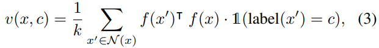
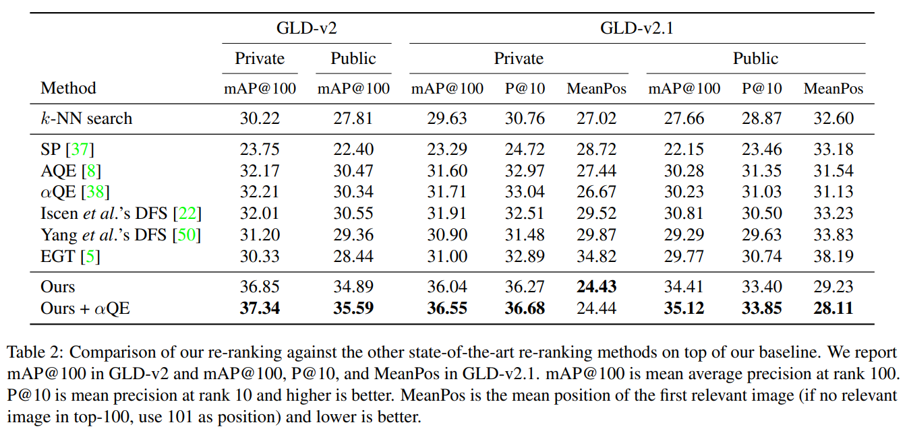

# Two-stage Discriminative Re-ranking for Large-scale Landmark Retrieval
- Google Landmark Retrieval 2019 1위
- Google Landmark Recognition 2019 3위
- Code: [Link](https://github.com/lyakaap/Landmark2019-1st-and-3rd-Place-Solution)

---

## Main Contribution
- CNN을 이용하여 image에서 embedding를 획득하고, re-ranking 방법으로 최종 결과 접근
- Re-ranking approach 제안
  - sort-step
    - kNN neighbor search를 이용해 soft-voting
  - insert-step
    - 앞선 similarity를 통해서 찾지 못한 이미지 중에 추가
- automatic data cleaning 진행

---

## Embedding Model
- cosine softmax loss 이용
- ResNet 101 + GeM(Generalized Mean) pooling + ArcFace loss(with L2-regularization)
- GeM pool layer 이후에 FC를 2048 -> 512
  - overfitting 방지
  - computational cost 감소
- FC 이후에 1-d Batch norm 추가
  - generalization 증가

---

## Two-stage Discriminative Re-ranking
- 동일한 장소여도 실내, 실외에 따라 visual-similarity는 전혀 다를 수 있음
  - 이를 해결하기 위해 label 정보를 이용한 re-ranking 방법 제안

### 방법
- index-set의 sample들에게 id할당(id는 train set에 kNN search를 이용하여)

- Query 이미지가 들어오면 마찬가지로 label 예측
  - index set에서 query와 label이 같으면 **postive samples** 다르면 **negative sampels**로 정의
- positive sample을 우선순위로 올리고, negative sample는 오른쪽으로 옮김(positive 사이의 우선순위는 유지)
- kNN search에 의해 검색되지 않은 positive sample 추가
- kNN cosine similrity를 이용하여 정렬된 positive sample들을 re-rank
- (train set안에 query가 존재하지 않을 경우, prediction score 매우 낮음 -> 이를 방지하기 위해 threshold보다 낮은 sample는 삽입 하지 않음)

---

## Dataset
- DELF & RANSAC를 활용하여 dataset cleaning

---

## Result

