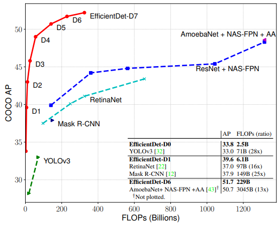

# EfficientDet: Scalable and Efficient Object Detection
---
## Abstract
- Model의 효울성은 computer vision분야에서 중요성이 증가되고 있음
- Efficiency를 높이기 위한 Key-Optimization 방법 제안
  - weighted bi-directional feature pyramid network(BiFPN)
  - compound scaling 방법
- COCO Test-dev에서 EfficientDet-D7로 52.6 AP 달성(#param: 52M, #FLOPs: 325B)

---
## Introduction
- Objection Detection 분야가 엄청나게 발전되고 있지만, 이는 Model size 증가 & computation cost 증가로 이어지고 있음 -> model size 및 latency 때문에 로보틱스, 자율 주행등 real-world applications에서 사용하기 어려움
  - ex) AmoebaNet-based NASFPN detector: (#param: 167M, #FLOPs: 3045B)
- 따라서, 효율을 겨냥한 detector architectures가 연구되고 있음. 하지만 정확도에서 낮은 성능을 보임
  - one-stage detectors
    - [25] SSD: Single shot multibox detector. ECCV, 2016.
    - [31] Yolo9000: better, faster, stronger. CVPR, 2017.
    - [32] Yolov3: An incremental improvement. arXiv preprint arXiv:1804.02767, 2018.
    - [22] Focal loss for dense object detection. ICCV, 2017.
  - anchor-free detectors
    - [19] Cornernet: Detecting objects as paired keypoints. ECCV, 2018.
    - [42] Objects as points. arXiv preprint arXiv:1904.07850, 2019.
    - [38] Fcos: Fully convolutional one-stage object detection. ICCV, 2019.
  - compress existing models
    - [26] Rethinking the value of network pruning. ICLR, 2019.
    - [27] Yolo-lite: a real-time object detection algorithm optimized for non-gpu computers. arXiv preprint arXiv:1811.05588, 2018.
- 위 논문들은 최대한의 경량화에 초점이 맞춰있는데, real-world에서는 3B ~ 300B FLOPs까지 다양한 리소스 제약이 존재함(300B FlOPs를 쓸수있는데 3B FLOPs 모델을 쓸 필요가 있을까??)
  - 해당 논문에서는 detector architectures의 backbone, feature fuision, class/box network의 디자인 선택에 설명하고 큰 두 과제를 검증
    - efficient multi-scale feature fusion
      - multi scale feature fusion을 위하여 FPN이 널리 사용되고 있는데, 대부분은 feature layer를 sum으로 적용. 하지만 이 features는 resolution이 다르기 때문에 동일한 weight를 주는 것은 잘못됨. 이 문제를 극복하기 위해 BiFPN제안. BiFPN으로 top-down, bottom-up하면서 결합되는 feature layer들 사이에 weight를 학습하여 서로 다른 weight를 할당
    - model scaling