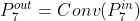
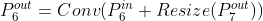
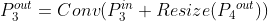
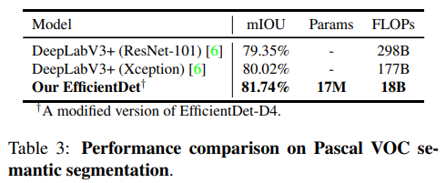
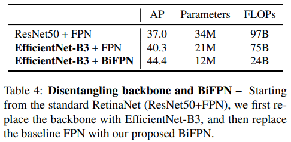

# EfficientDet: Scalable and Efficient Object Detection
---
## Abstract
- Model의 효성은 computer vision분야에서 중요성이 증가되고 있음
- Efficiency를 높이기 위한 Key-Optimization 방법 제안
  - weighted bi-directional feature pyramid network(BiFPN)
  - compound scaling 방법
- COCO Test-dev에서 EfficientDet-D7로 52.6 AP 달성(#param: 52M, #FLOPs: 325B)

---
## Introduction
- Objection Detection 분야가 엄청나게 발전되고 있지만, 이는 Model size 증가 & computation cost 증가로 이어지고 있음 -> model size 및 latency 때문에 로보틱스, 자율 주행등 real-world applications에서 사용하기 어려움
  - ex) AmoebaNet-based NASFPN detector: (#param: 167M, #FLOPs: 3045B)
- 따라서, 효율을 겨냥한 detector architectures가 연구되고 있음. 하지만 정확도에서 낮은 성능을 보임
  - one-stage detectors
    - [25] SSD: Single shot multibox detector. ECCV, 2016.
    - [31] Yolo9000: better, faster, stronger. CVPR, 2017.
    - [32] Yolov3: An incremental improvement. arXiv preprint arXiv:1804.02767, 2018.
    - [22] Focal loss for dense object detection. ICCV, 2017.
  - anchor-free detectors
    - [19] Cornernet: Detecting objects as paired keypoints. ECCV, 2018.
    - [42] Objects as points. arXiv preprint arXiv:1904.07850, 2019.
    - [38] Fcos: Fully convolutional one-stage object detection. ICCV, 2019.
  - compress existing models
    - [26] Rethinking the value of network pruning. ICLR, 2019.
    - [27] Yolo-lite: a real-time object detection algorithm optimized for non-gpu computers. arXiv preprint arXiv:1811.05588, 2018.
- 위 논문들은 최대한의 경량화에 초점이 맞춰있는데, real-world에서는 3B ~ 300B FLOPs까지 다양한 리소스 제약이 존재함(300B FlOPs를 쓸수있는데 3B FLOPs 모델을 쓸 필요가 있을까??)
  - 해당 논문에서는 detector architectures의 backbone, feature fuision, class/box network의 디자인 선택에 설명하고 큰 두 과제를 검증
    - efficient multi-scale feature fusion
      - multi scale feature fusion을 위하여 FPN이 널리 사용되고 있는데, 대부분은 feature layer를 sum으로 적용. 하지만 이 features는 resolution이 다르기 때문에 동일한 weight를 주는 것은 잘못됨. 이 문제를 극복하기 위해 BiFPN제안. BiFPN으로 top-down, bottom-up하면서 결합되는 feature layer들 사이에 weight를 학습하여 서로 다른 weight를 할당
    - model scaling
      - compound scaling을 적용
      - backbone의 resolution, width, depth, feature network, box/class prediction network 모두
- EfficientNet를 backbone로 두고, BiFPN을 적용하여 compound scaling를 통해, object detection에서 accuracy & efficiency 모두 만족하는 모델들을 만듦

---
## Releated Work
### One-Stage Detector
- 기존 one-stage는 simple하고 efficient를 고려하여 만들어짐(anchor등을 활용)
- 본 논문은 one-stage 디자인을 따르지만 accuracy & efficiency를 동시에 최적화한 network architecture 소개
### Multi-Scale Feature Representations
- object detection 분야에서는 multi-scale features
  - 그 중, FPN은 top-down 방식으로 multi scale features 결합
- PANet는 FPN에 extra bottom-up path를 추가
- M2det는 U-Shape 모듈 추가
- G-FRNet은 gate unit 소개(features 사의 정보의 흐름 조절)
- NAS-FPN은 자동으로 network topology를 탐색
  - 이 방식은 좋은 performance를 나타냈지만, 학습하기 어려움
### Model Scaling
- accuracy를 높이기 위해 backbone을 더 키우거나 input resoluition을 키움(512x512 -> 1536x1536)
- 이것은 모두 single 또는 제한적인 요소만 바꿈 -> Compound scaling 제안

---
## BiFPN

### Problem Formulation

- FPN은 위의 식으로 이루어짐. level 3-7로 feature가 이루어졌고 input resolution이 640x640이라면, P_3은 feature level3(640/2^3 = 80) 80x80 resolution

   
   
...   
   

- Resize는 upsampling 또는 downsampling

### Cross-Scale Connections
- PANet은 FPN이나 NAS-FPN보다 좋은 정확도를 갖지만, computational cost가 더 소모됨
- 위 모델에서 efficiency를 높이기 위한 방법들은 채택
  - 입력 edge가 하나뿐인 node를 제거 (중간의 맨위, 맨아래 node) -> 다른 feature와 융합하는데 기여도가 작음
  - 입력 node에서 출력 node로 뻗는 extra node 추가 -> 추가적인 cost 없이 더 많은 feature를 융합하기 위하여
  - PANet는 Top-down, Bottom-up path를 각각 한번씩 수행하는데, Effdet에서는 BiFPN module를 여러번 반복 -> High level feature 취득 가능

### Weighted Feature Fusion
- 기존 Pyramid attention network에서는 동등한 취급으로 feature 융합 -> 이를 해결하기위하여 weight 추가

   

|  | Comment |
|---|---|
| Unbounded fusion | computational cost가 적게 듬. 논문에서는 scalar 선택. scalar weight가 unbounded이므로 training 할 때 불안정(instability) |
| Softmax-based fusion | softmax를 이용가기 때문에 모든 weight가 0~1로 normalized된다고 할 수 있음. 하지만 softmax의 계산으로 인해 GPU 속도 저하 |
| Fast normalized fusion | Relu덕분에 wi >= 0은 보장되고, 분모가 0이되는 것을 방지하기 위하여 e=0.0001. softmax를 하지않고 0~1로 normalized가 되기 때문에 실험을 통해 accuracy는 softmax-based 방식과 비슷하고 30%의 GPU 속도 개선 |

- 각 conv는 efficiency를 위해 depthwise separable conv를 사용하고, batch norm 수행 후, activation 수행

---
## EfficientDet

   

### Efficient Architecture
- one-stage detector로 구성
- Feature network로는 제안한 BiFPN 사용
- backbone network에서 level 3-7 layer를 feature로 사용하며 BiFPN을 반복적으로 수행
- BiFPN이 수행된 feature layer 층을 Box/class predict network에 넣음
### Compound Scaling
- 기존 논문 들은 큰 input resolution, 더 많은 FPN layer의 중첩 등을 활용
  - 위 방법들은 제한적인 관점에서의 scaling
- EfficientNet에서 사용했던 compound scaling을 활용 (simple compound coefficient 하나만으로)
  - 하지만 object detector에는 backbone, BiFPN, class/bax Network들이 있어 grid search 방법은 너무 오래 걸림 -> heuristic 기반의 접근으로 수행

   

#### Backbone Network
- EfficientNet와 동일한 width/depth scaling coefficients 활용
#### BiFPN Network
- BiFPN depth는 coef에 따라 linear하게 증가
- BiFPN width는 gird search list를 만듦 = {1.2, 1.25, 1.3, 1.35, 1.4, 1.45}
  -> 1.35가 가장 좋았음
#### Box/class prediction network
- width는 BiFPN의 width와 동일
- depth는 linear하게 증가
#### Input image resolution
- feature를 뽑기 위해 level 3-7 layer를 쓰려면 input size가 128보다 커야함

## Experiments
### EfficientDet for Object Detection
- COCO 2017 dataset (118K images)
- SGD Optimizer(momentum=0.9, weight decay=4e-5)
- 첫 epoch에서 learning rate 0 ~ 0.16으로 linear하게 증가. 그 다음 epoch부터는 CosineAnnealingLR 사용
- 모든 convolution 이후에는 batch norm 추가(decay=0.99, epsilon=1e-3)
- exponential moving average=0.9998
- Focal loss 사용(alpha=0.25, gamma=1.5)
- aspect ratio={1/2, 1, 2}
- 300 epochs 수행(D7 모델은 500 epochs)
- 128 batch size (32 TPUv3 Cores 사용)
- preprocessing는 RetinaNet[22]와 동일하게 croping/scaling flipping 활용. Auto-augmentation 사용하지 않음

   

- 결과, 4x-9x 모델 사이즈 작아짐. 13x-42x FLOPs 작아짐
- EfficientDet-D0는 YoloV3에 비하여 정확도는 조금 떨어지지만 28x FLOPs 작아짐
- Mask-RCNN, RetinaNet와 비교하면 EfficientDet-D1이 비슷한 정확도에 더 작은 FLOPs
- EfficientDet-D7은 SOTA 달성
- 특히 고정된 anchor 및 auto-augmentation 없이 위 정확도 보임

   

- inference time에서도 기존 보다 GPU에서 4.1x CPU에서 10.8x 빨라짐
### EfficientDet for Semantic Segmentation

   

-  semantic segmentation에서도 검증위해 실험
- P2 feature layer를 추가하여 per-pixel classification 으로 활용
- EfficientDet-D4 기반(ResNet-50과 비슷한 모델 사이즈)
- channel size=(BiFPN=128, classification head=256)
- BiFPN, classification 모두 3회 반복
- ensemble, testtime augmentation, or COCO pretraining 모두 없음
- 1.7x 정확도 향상, 9.8x FLOPs 감소

---
## Ablation Study
### Disentangling Backbone and BiFPN

   

- 위 표를 통해 EfficientNet와 BiFPN이 좋다!! 는 것을 증명
### BiFPN Cross-Scale Connections

   

- features 사이의 cross-scale connections 종류별 accuracy & efficiency
- Top-down FPN은 여러번 반복해도 accuracy가 낮은 것으로 보여 bottom-up으로 connections이 없이는 accuracy를 높이는데 한계가 있는 것을 증명
- repeated FPN + PANet는 accuracy는 높지만 여전히 FLOPs는 많음
- BiFPN은 Accuracy는 repeated FPN + PANet와 비슷하지만 더 적은 FLOPs -> weight를 추가하면 accuracy까지 높아지는 것을 확인
### Softmax vs Fast Normalized Fusion

   

- 위 표를 보면 AP의 하락에 비하여 30%가량의 속도 증가 보임

   

- 위 그림을 보면 norm weight가 빠르게 변하는 것을 볼 수 있고, 이 그림으로 feature layer가 융합시 서로 다르게 weight를 주는 것을 확인할 수 있음 (main contribution인 feature layer 융합시 서로 다르게 weight를 줘야한다는 것을 증명)
- 또한, fast-norm 방식과 softmax 방식이 비슷한 경향으로 따라가기 때문에 fast-norm의 타당성도 검증
### Compound Scaling

   

- 동일한 FLOPs 기준으로 한 측면에서 scaling하는 것 보다, jointly scaling이 더 나은 효율성을 보이는 것을 확인
