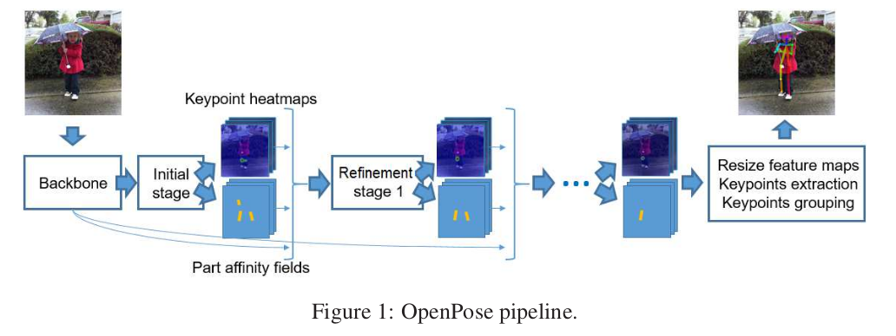
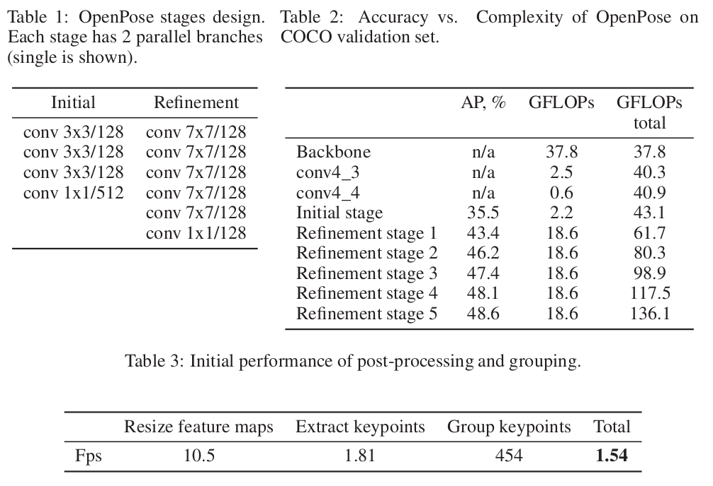
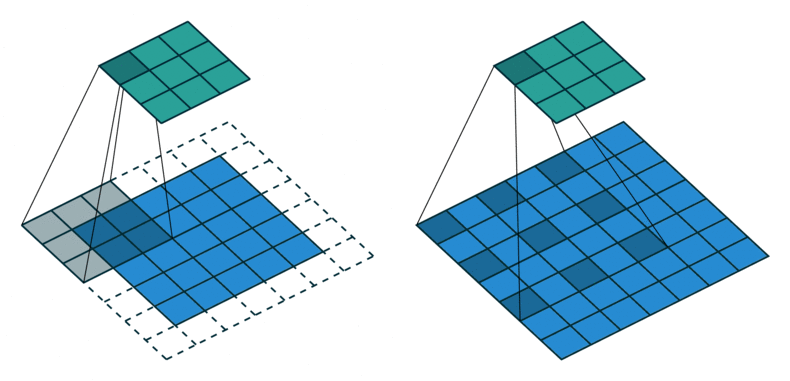
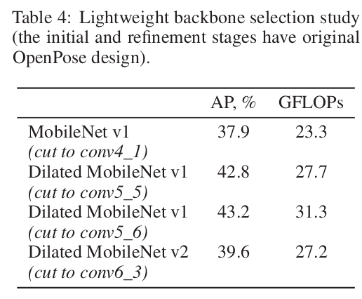
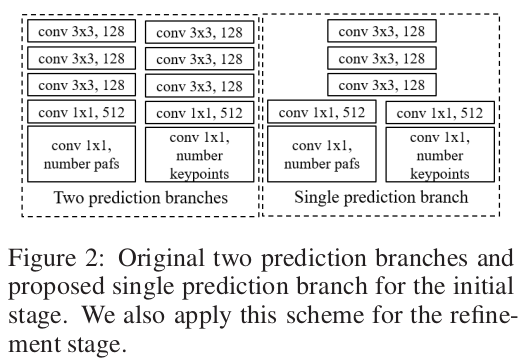
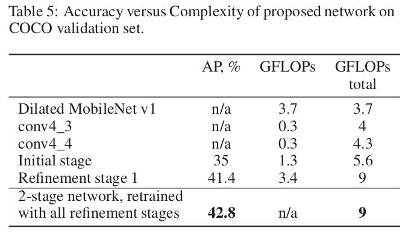

# Real-time 2D Multi-Person Pose Estimation on CPU: Lightweight OpenPose

---

## Intorduction
- OpenPose를 최적화 하여 아래의 속도 달성(AP 1% 이하 하락)
  - 28 fps on mini PC Intel® NUC, which consumes little power and has 45 watt CPU TDP.
  - 26 fps on a usual CPU without the need of a graphic card.

---

## Related Work
- Multi-person pose estimation의 두가지 방식
  - Top-down
    - detector를 이용하여 person을 검출하고, 각 검출된 person에 pose estimation 알고리즘을 수행
    - inference 속도는 person의 개수에 따라 달라짐
  - Bottom-up
    - 영상 내에서 keypoint를 검출하고, 각 person끼리 그룹화 진행

---

## Analysis of the Original OpenPose
### Inference Pipeline

- Inference 네트워크의 output은 Keypoint heatmaps와 pairwise relations(part affinity fields, pafs)로 구성되어있음. (원본의 8배 축소)
- 마지막에는 person keypoint 그룹화, 원본 영상 크기로 resize, heatmaps에서 peak point 추출하여 keypoint 검출 진행
- 첫 번째 스테이지에서는 initial heatmaps, pafs를 추출하고, 5번의 fine stages를 통해 refinement
- refinement 후에 나온 heatmaps와 pafs에서 keypoint pairs을 통해 그룹화

### Complexity Analysis

- 기존 논문은 VGG-19 backbone의 conv4_2에서 feature를 추출(해당 논문은 MobileNet v1 이용)한 후, conv4_3, conv_4_4를 추가하고 initial 및 5 refinement 스테이지 진행
- 각 스테이지는 2 branch로 구성됨(heatmaps, pafs). 두 branch 디자인은 동일.
- 위 Table2를 보면, Refinement stage 1 이후는 성능 개선이 더디므로 본 논문에서는 inital 스테이지와 하나의refinement만 유지(2~5 refinement stage 삭제)
- post-processing 부분에서는 Group keypoints 부분 빼고 최적화 필요

---

## Optimization
### Network Design
- 학습 파라미터는 기존 논문과 동일하게 적용
- COCO dataset 학습
- 1개의 refinement stage만 사용하지만, 2~5 refinement stage는 정규화(regularizing)효과를 제공하기 때문에 최종 네트워크는 stage를 추가해서 재학습

### Lightweight Backbone
- MobileNet v1 사용
- 하지만, 기존 MobileNetv1을 그대로 사용하면 성능 저하 -> Dilated Residual Networks 도입
- MobileNet v2도 시도해봤지만 좋은 결과 못 얻음

### Lightweight Refinement Stage

- Heatmaps와 pafs가 개별적인 레이어로 동작한 것을 마지막 두 레이어를 제외하고 모든 레이어를 공유하는 형태로 변경
- 7x7 사이즈의 커널을 1x1, 3x3, 3x3(dilation parameter: 2)로 변경하여 동일한 receptive field를 가지면서 효율성을 높임
- 채널수 감소

### Fast Post-processing
- 추가적인 메모리 할당 제거, Keypoint 추출 병렬화
- 마지막 bottleneck는 feature maps을 입력 이미지 크기로 resize하는 부분
  - Resize 단계를 건너뛰고 네트워크 출력에서 직접적으로 그룹화 하는 경우는 정확도 하락
  - 입력 사이즈만큼 키우지 않고 8 factor만 키워도 정확도가 같은 것을 확인

### Inference
- OpenVINO TM Toolkit R4 사용하여 서로 다른 하드웨어에서도 최적화(CPU, GPU, FPGA)
- Intel NUC6i7KYB, 6-core Core i7-6850K CPU 두 하드웨어에서 속도 측정
  - Intel NUC6i7KYB : GPU Iris Pro Graphics P580 in half-precision floating-point format (FP16)
  - i7-6850K : single-precision floating-point format (FP32)
- 입력 이미지 크기는 456 x 256(116,736 pixel)
  - 368 x 368(135,424 pixel)과 비슷하지만 16:9 비율

---

## Conclusion
- 네크워크 디자인과 post-processing의 최적화를 통해 edge 디바이스에서 real-time 동작 달성
- Quantization, Pruning, Knowledge distillation등을 통해 더 성능향상을 노려볼 수 있음