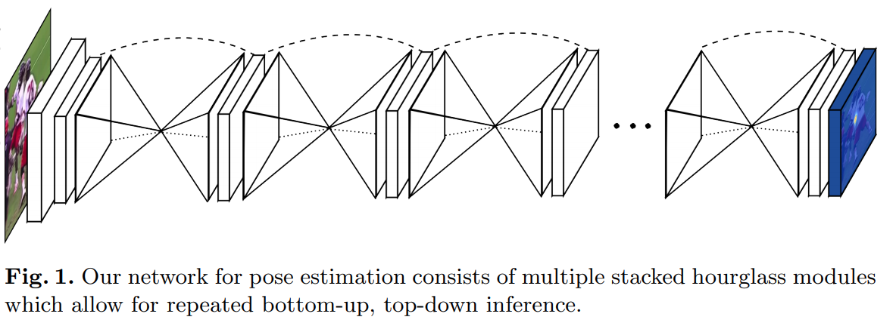
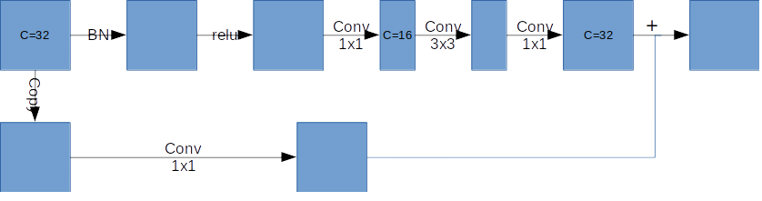
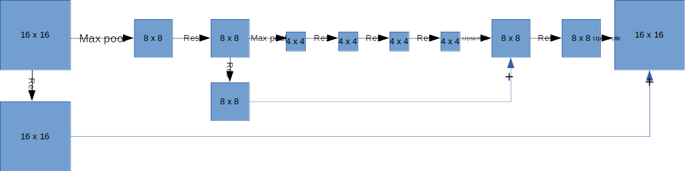
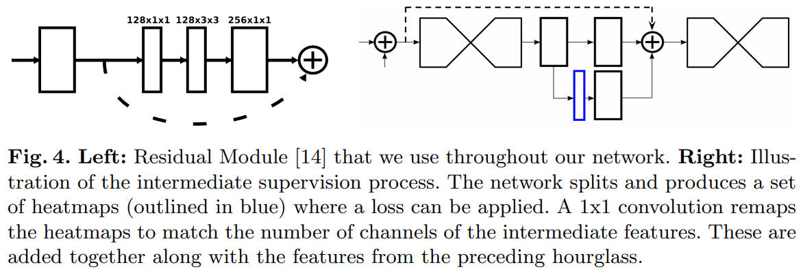
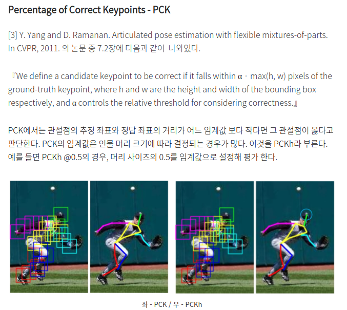
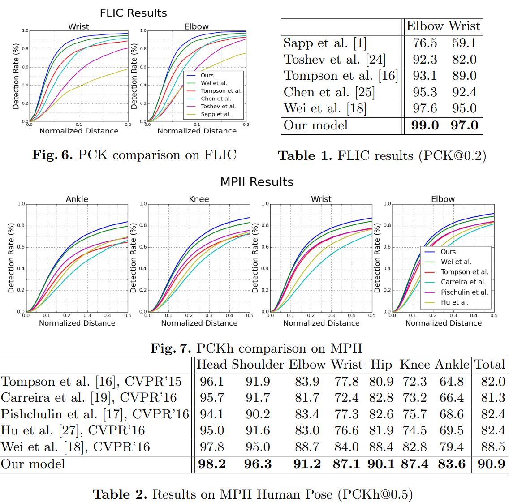
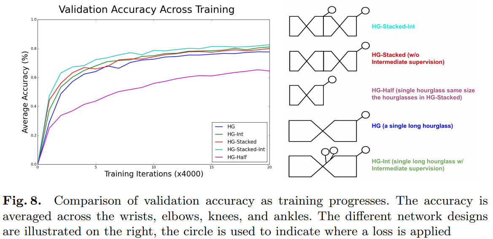
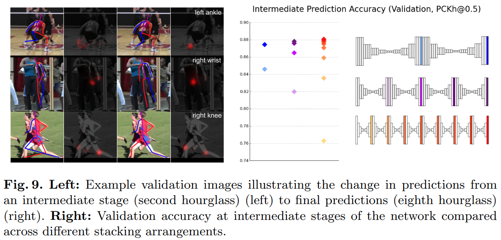

# Stacked Hourglass Networks for Human Pose Estimation

---

## Introduction




- Hourglass Network 채택
  - 이미지의 모든 스케일 정보를 통합하는 것이 특징
- Hourglass Network를 연속적으로 연결하여 하나의 Network 디자인 생성 -> 'Stacked Hourglass'
- MPII 및 FLIC dataset에서 SOTA 달성

---

## Network Architecture

### Hourglass Design
- Pose estimation에서 각 keypoint(얼굴, 손 등)을 찾는데는 Local 정보가 필요하지만, 최종적인 결과를 위해서는 Body 전체의 이해가 필요(사람의 방향, 팔다리의 배열 및 인접한 관절의 관계 -> Global 정보의 학습 필요)
- Global 부터 Local 정보까지 모든 스케일에 대해 효율적으로 학습할 수 있는 모델이 Hourglass라고 생각됨
  - 일부 논문은 이미지를 분리하거나, 이미지를 여러 Resolution으로 나눠 모델을 통과시킨 다음 결합하는 방법들이 있는데, 본 논문은 end-to-end 방식의 Single Model로 이를 달성
- 진행 순서
  1. Convlution2D + max pooling로 최대한 작은 resolution까지 진행
      - max pooling 후에는 branch 생성 및 추가적인 conv 적용하여 각 resolution의 feature 생성(local feature)
  2. Uplsample 및 feature와 결합
      - upsampling은 NN방법, 결합은 add
  3. Output Resolution까지 도달하면 1x1 Conv 적용하여 최종 Heatmap 생성

```Python

from torch import nn

Pool = nn.MaxPool2d

def batchnorm(x):
    return nn.BatchNorm2d(x.size()[1])(x)

class Conv(nn.Module):
    def __init__(self, inp_dim, out_dim, kernel_size=3, stride = 1, bn = False, relu = True):
        super(Conv, self).__init__()
        self.inp_dim = inp_dim
        self.conv = nn.Conv2d(inp_dim, out_dim, kernel_size, stride, padding=(kernel_size-1)//2, bias=True)
        self.relu = None
        self.bn = None
        if relu:
            self.relu = nn.ReLU()
        if bn:
            self.bn = nn.BatchNorm2d(out_dim)

    def forward(self, x):
        assert x.size()[1] == self.inp_dim, "{} {}".format(x.size()[1], self.inp_dim)
        x = self.conv(x)
        if self.bn is not None:
            x = self.bn(x)
        if self.relu is not None:
            x = self.relu(x)
        return x
    
class Residual(nn.Module):
    def __init__(self, inp_dim, out_dim):
        super(Residual, self).__init__()
        self.relu = nn.ReLU()
        self.bn1 = nn.BatchNorm2d(inp_dim)
        self.conv1 = Conv(inp_dim, int(out_dim/2), 1, relu=False)
        self.bn2 = nn.BatchNorm2d(int(out_dim/2))
        self.conv2 = Conv(int(out_dim/2), int(out_dim/2), 3, relu=False)
        self.bn3 = nn.BatchNorm2d(int(out_dim/2))
        self.conv3 = Conv(int(out_dim/2), out_dim, 1, relu=False)
        self.skip_layer = Conv(inp_dim, out_dim, 1, relu=False)
        if inp_dim == out_dim:
            self.need_skip = False
        else:
            self.need_skip = True
        
    def forward(self, x):
        if self.need_skip:
            residual = self.skip_layer(x)
        else:
            residual = x
        out = self.bn1(x)
        out = self.relu(out)
        out = self.conv1(out)
        out = self.bn2(out)
        out = self.relu(out)
        out = self.conv2(out)
        out = self.bn3(out)
        out = self.relu(out)
        out = self.conv3(out)
        out += residual
        return out 

class Hourglass(nn.Module):
    def __init__(self, n, f, bn=None, increase=0):
        super(Hourglass, self).__init__()
        nf = f + increase
        self.up1 = Residual(f, f)
        # Lower branch
        self.pool1 = Pool(2, 2)
        self.low1 = Residual(f, nf)
        self.n = n
        # Recursive hourglass
        if self.n > 1:
            self.low2 = Hourglass(n-1, nf, bn=bn)
        else:
            self.low2 = Residual(nf, nf)
        self.low3 = Residual(nf, f)
        self.up2 = nn.Upsample(scale_factor=2, mode='nearest')

    def forward(self, x):
        up1  = self.up1(x)
        pool1 = self.pool1(x)
        low1 = self.low1(pool1)
        low2 = self.low2(low1)
        low3 = self.low3(low2)
        up2  = self.up2(low3)
        return up1 + up2
```




### Layer Implementation
- Residual & Bottleneck 구조를 이용
- 3x3이상의 filter은 사용하지 않음
- 256x256크기는 GPU메모리를 많이 사용하므로, input에 7x7(stride=2) conv 및 Max pooling를 적용하여 64x64로 만든 후, Hourglass model에 입력

```Python
# Input size: (256, 256, 3)

# Initial processing of the image
local cnv1_ = nnlib.SpatialConvolution(3,64,7,7,2,2,3,3)(inp)           # 128
local cnv1 = nnlib.ReLU(true)(nn.SpatialBatchNormalization(64)(cnv1_))
local r1 = Residual(64,128)(cnv1)
local pool = nnlib.SpatialMaxPooling(2,2,2,2)(r1)                       # 64
local r4 = Residual(128,128)(pool)
local r5 = Residual(128,opt.nFeats)(r4)
```

- Hourglass 모델의 전체 residual 모듈의 output channel은 256

### Stacked Hourglass with Intermediate Supervision
- 본 논문의 방식은 Hourglass Network을 반복적으로 수행하는데, 이 접근법에서는 각 Hourglass의 output이 모두 동일하기 때문에, 중간의 Heatmap을 loss로 계산할 수 있음
- 각 Hourglass에서의 loss 계산은 Local 및 Global feature를 처리할 수 있는 각 Hourglass의 끝에서 진행
- 위의 loss를 추가하면 High-level feature의 spiatial relationship을 추가적으로 학습 가능
  - 다른 논문들도 multi stage 및 Intermediate Supervision을 통해 성능을 높임
- Single Hourglass에서는 Intermediate Supervision을 넣을 적합한 위치가 존재하지 않음
- Hourglass를 반복함으로써 각 Hourglass모델에서 local 및 global feature가 결합되게 되고, Intermediate Supervision를 수행 가능
  - 다음 Hourglass에서는 refine된 feature를 통해 더 높은 성능을 나타낼 수 있음



- intermediate predictions에 1x1 conv를 적용하여 그 차원수를 증가시키고, 이를 이번 hourglass stage의 intermediate features와 이전 hourglass stage에서의 features output과 합산
- 최종 모델은 8개의 Hourglass 사용

### Training Details
- Dataset
  - FLIC, MPII 데이터셋 사용하여 성능 검증
    - FLIC: 5,003개의 이미지(3,987개 학습 이미지, 1,016 테스트 이미지)
    - MPII: 25,000개의 이미지에서 40,000개의 annotated 샘플(28,000개 학습 샘플, 11,000개 테스트 샘플)
      - 학습할 때는 학습샘플 중 3,000개 정도 추출해서 validation 진행
- Augmentation
  - 256x256으로 Resize
  - -30 ~ +30도 Rotation, 0.75 ~ 1.25 Scaling
  - Translation은 안함 -> Target Person의 위치는 중요한 cue이기 때문에
- Framework & Hardware
  - Torch7
    - Optimizer = rmsprop, lr = 2.5e-4, 5번 validation acc가 증가안하면 learning rate 감소
  - TitanX 12GB
    - 학습에 3일 걸림
    - Single forward pass = 75ms
  - 최종 테스트 결과는 Origin & Flip 이미지를 넣어서 두 Heatmap의 평균을 이용(1% 정도 향상 -> TTA)
  - loss = MSE, GT heatmap은 Keypoint를 기준으로 2D Gaussian 적용
  - 정확도를 높이기 위해, 원래의 좌표로 변환 전에 (64 -> 256 말하는 듯) 두번째로 높은 인접 값을 갖는 위치로 1/4 pixel offset 적용
  - Keypoint가 없을 때는 Heatmap all zero

---

## Result

### Evaluation
- PCK사용





- SOTA 달성

### Ablation Experiments (Stacked Hourglass에 대한 효용성)




- 위 영상을 보면 두 번째 Heatmap에서는 여러 사람이 있을 경우 헷갈리는 것을 볼 수있지만 최종 Heatmap에서는 정확한 위치를 찾는 것을 알수 있음
  - 가운데 영상에서는 두 번째 Heatmap에서는 아무 손목이나 찾았지만, 최종 결과에서는 보이지 않는 오른쪽 손목 찾아냄

---

##  Further Analysis

### Multiple People
- ROI 안에 여러 사람이 존재할 겨웅 Network는 Keypoint를 추출하기 어려움
  - 본 논문에서는 이를 해결하기 위해 Translation Augmentation을 적용하지 않고, Center에 목표로하는 사람을 가져다 둠
  - Figure10에서 1, 3번째 사진은 26픽셀 이동한 차이 (그리고 약간의 scale 차이)
- 사전에 Scale 및 Center의 보정을 정확하게 하면 Network가 Target의 사람을 선택하기 수월함 -> Annotation의 기준으로 문제를 품
- (개인 의견) 이를 달성하기 위해서는 Detection의 성능이 중요할 것으로 보임. 검출 시 Center가 정확할 수 있을까?
