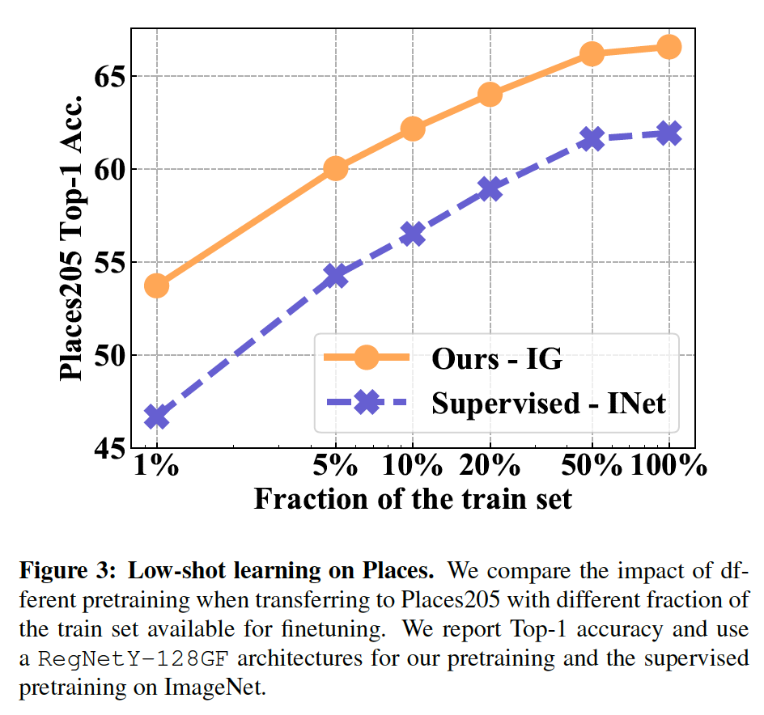
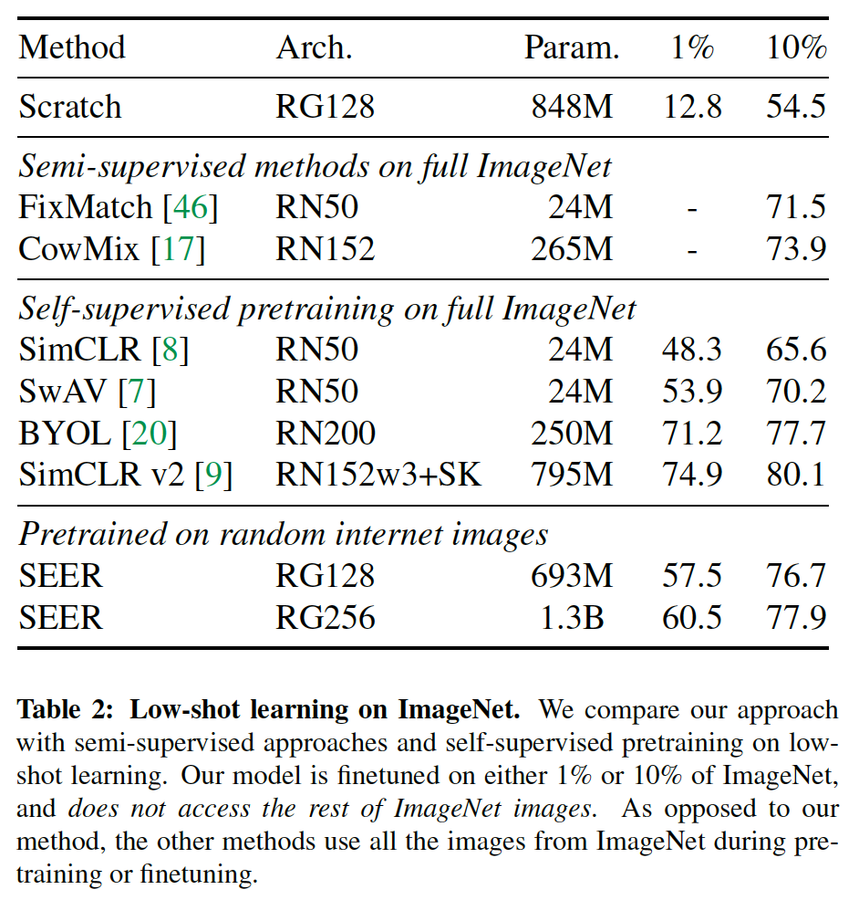
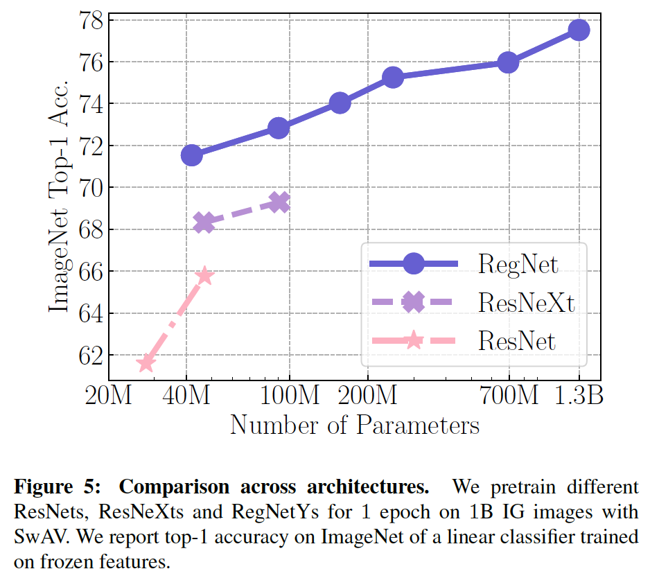
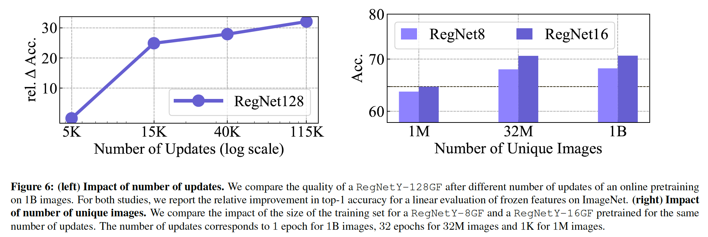
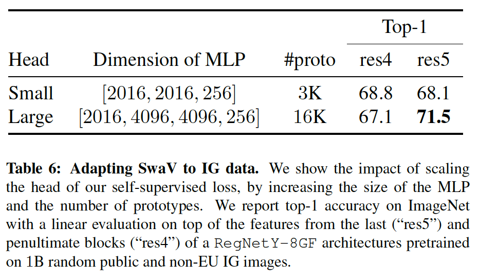

# Self-supervised Pretraining of Visual Features in the Wild

---

## Intorduction
- Self-supervised의 성공요인 2가지
  - 거대한 데이터셋
    - GPT-3는 300B이상의 단어로 사전 학습되었고, Wav2vec2.0은 53K 시간 이상의 오디오로 학습됨.
  - 거대한 모델(수천억 이상의 파라미터를 가진)
- 기존에는 unlabeled 데이터라고 해도, 어느정도 정제된 데이터를 사용하였는데 매우 큰 정제되지 않은 무작위 데이터에 대해서도 잘 될까?
  - 이게 잘되면 계속 데이터를 넣어주고, 계속 학습하여 진화하는 시스템을 만들 수 있음(궁극적인 목표)

### *FACEBOOK은 Instagram을 갖고 있다 -> 무작위 다양한 영상을 엄청나게 많이 갖고 있다 -> 학습해보자!!*

- 논문의 분석 내용
  - RegNet 사용
  - 2B의 무작위 이미지를 SwAV[[paper]](https://arxiv.org/abs/2006.09882)[[참고 blog]](https://cool24151.tistory.com/84)[[meduim]](https://medium.com/@nainaakash012/unsupervised-learning-of-visual-features-by-contrasting-cluster-assignments-fbedc8b9c3db) 방식을 이용해 학습 진행
  - 메모리 사용량을 줄이기 위해 Mixed precision 방법 및 gradient checkpointing 방법 도입

||왜 RegNet??|
|-------|------------|
|1|효율성, 성능이 좋은 모델|
|2|파라미터 양의 조절이 자유로움|
|3|(개인적 의견) Facebook에서 발표한 아키텍쳐(SwAV도 Facebook에서 발표)|

---

## Method

### Self-Supervised Pretraining

- [[paper]](https://arxiv.org/abs/2006.09882)
- [[참고 blog]](https://cool24151.tistory.com/84)
- [[meduim]](https://medium.com/@nainaakash012/unsupervised-learning-of-visual-features-by-contrasting-cluster-assignments-fbedc8b9c3db)

### Scale efficient model family: RegNetY

- [[paper]](https://arxiv.org/abs/2003.13678)
- [[medium]](https://medium.com/analytics-vidhya/regnet-or-how-to-methodologically-design-effective-networks-c3560c1cf436)
- RegNetY-256GF
  - 위 논문에서는 32GFlops 가진 모델까지만 소개되었지만 본 논문에서는 parameter scaling을 통해 256GF 모델 생성
  - 1B 이미지를 학습하는데 얼마나 걸릴까?
      - V100 32G GPU 512개를 이용, batch size는 8704 images를 하면 1 iter에 6125ms 소모 -> 학습에 걸리는 시간 8일

### Optimization and Training at Scale
- 학습에 이용된 기법들 소개

| 기법 | 내용 |
|-----|-----|
|Learning rate schedule|cosine wave 방법과 고정 LR 방법. cosine wave 방법은 많이 사용되지만 online 학습에서는 data들간의 weight가 달라지기 때문에 또한 주기를 얼마나 줄 것인가??도 명확하지 않기 때문에 고정 LR을 사용하고, loss가 더이상 감소하지 않으면 LR /= 2를 하는 방식을 적용. 단, 1B 이미지 학습에서는 고정된 개수 이기 때문에 cosine wave 방식 적용
|Reducing memory consumption per GPU|gradient checkpointing[[pytorch example]](https://github.com/prigoyal/pytorch_memonger/blob/master/tutorial/Checkpointing_for_PyTorch_models.ipynb) 및 mixed precision 적용.|
|Optimizing Training speed|GPU들은 FP32 보다 FP16 연산 속도가 빠르므로 mixed precision을 적용하면 메모리 효율뿐만이 아니라 학습 속도도 빨라짐. 거기에 SyncBatchNorm을 적용|
|Large scale Pretraining data| 인스타그램에서 무작위로 이미지를 샘플링하는 dataloader적용. 해시태그 같은 추가정보 제외, 중복된 이미지도 그대로 사용, 전처리 없음. 90일마다 dataset 바뀌나(정책??) 모델 성능 저하 없음|

- Implementation details
  - RegNetY-256GF(with SwAV)
  - 6개의 크롭 이미지 사용(2개의 224x224, 4개의 96x96)
  - data augmentation은 SwAV 논문과 동일하게 적용
  - HEAD MLP(3 layers) : 10444x8192 -> 8192x8192 -> 8192x256
  - 16K prototypes, Sinkhorn regularization, synchronize BatchNorm Group = 64, weight decay = 10^-5
  - LARS optimizer[[paper]](https://arxiv.org/abs/1708.03888)
  - batch size = 8192(16 per GPU)
  - LR = 0.15 -> 9.6 warmup(8K 학습에서), 그 이후 cosine LR은 최종적으로 0.0096

---

## Main Results

### Finetuning Large Pretrained Models

- RegNetY-{8,16,32,64,128,256}GF 6개의 모델 진행
- ImageNet Finetune
  - 35 epochs, SGD, batch size=256, LR=0.0125 -> 0.00125, weight decay=10^-4

- 256GF 모델은 정확도 84.2%로 SimCLRv2에 비하여 1% 오른 결과를 보여줌

### Low-shot learning

- ImageNet과 Places205 dataset으로 진행
- ImageNet을 supervised pre-training한 모델과 비교

- Places205

- 인스타그램으로 학습한 이미지가 더 특성에 맞게 잘 학습되고, non-uniform distributiuon이 오히려 unbalance한 Places205에 유리했다(?)

- ImageNet

### Transfer to Other Benchmarks

- Linear evaluation of image classification

- Detection and segmentation

### Comparing to Weakly-Supervised Pretraining
- [Exploring the Limits of Weakly Supervised Pretraining](https://arxiv.org/pdf/1805.00932.pdf)에서는 해시태그 이용하여 성능을 올렸는데, SEER 방식으로 근접하는 성능을 달성

### Impact of the Model Architecture
- Resnet, ResNeXt, RegNet을 동일하게 학습하여 비교

- 위 결과를 보면, RegNet 모델의 성능이 뛰어나다는 것을 보이면서, 다른 모델도 capacity(모델의 크기)가 증가할 수록 성능이 향상되는 것을 알 수 있음

### Scaling the Training Data

- 왼쪽 그래프를 보면, 1B 이미지를 학습하는 동안 성능이 saturation되지 않고 계속 오르는 것을 확인 -> 더 많은 학습으로 성능 향상 가능성
- 오른쪽 그래프는, 1B 이미지로 1epoch을 학습한 것과 32M 이미지로 32epochs를 학습하여 비교. 32M과 1B의 결과가 비슷
- 위의 결과로, 동일한 이미지를 여러번 학습하는 효과 보다는 학습횟수를 증가시키는 것이 성능을 높이는데 유의미 한 결과를 얻을 수 있음

### Scaling the self-supervised model head

## Conclusion
- 해당 논문은 ImageNet이 아닌 엄청나게 많은 wild 이미지(해당 논문에서는 인스타그램 이미지)를 엄청나게 큰 모델에 self-supervised 학습을 하여 pretrained된 모델이 다양한 어플리케이션에 적용될 수 있다는 가능성을 확인
- 기존에도 ImageNet pretrained model이 모든 분야에서 좋은 성능을 보이지 않는 다는 얘기는 나오고 있었음. Facebook, Google 같은 업체의 경우 online self-supervised 학습을 통해 지속적인 pretrained 모델을 업데이트하고, 해당 모델을 각 Task에 fine-tuning에 하는 방법으로 다양한 분야에서 성능 향상을 할 것으로 예상됨