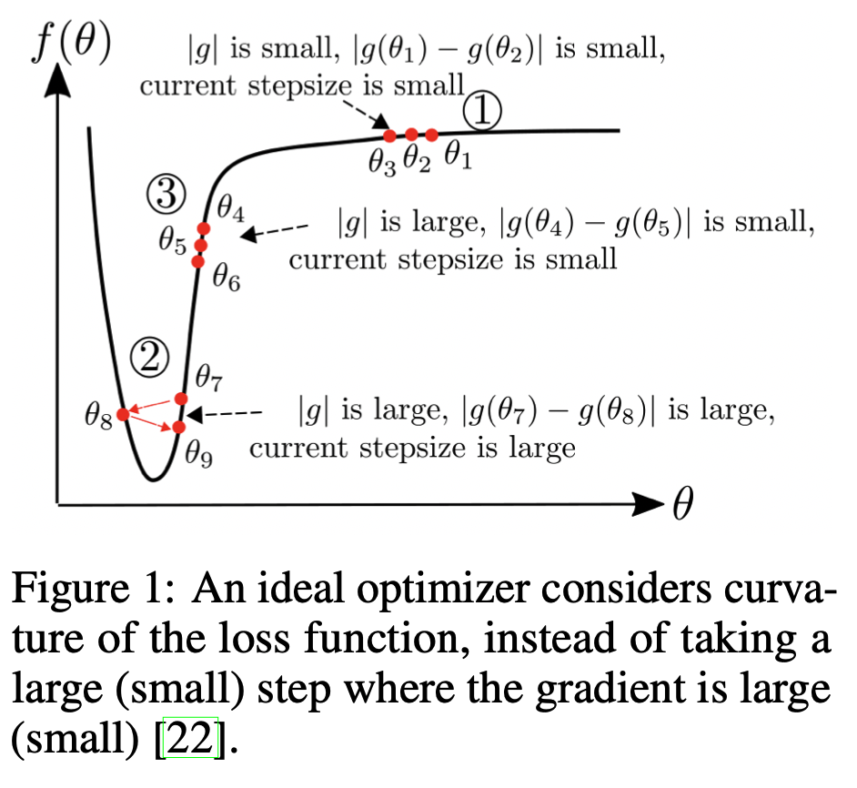
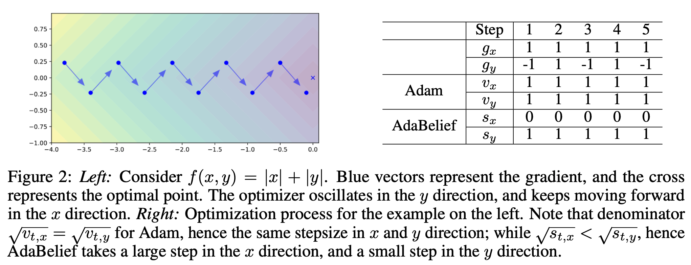
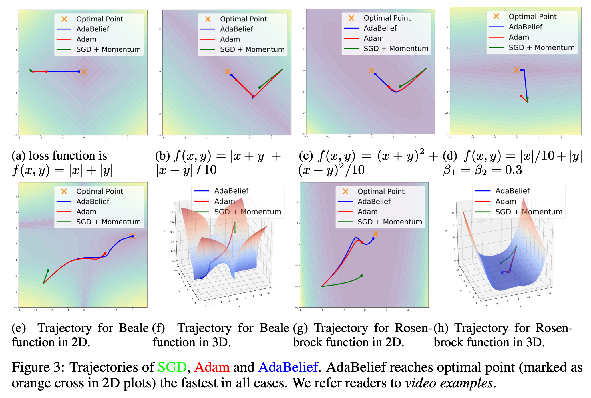
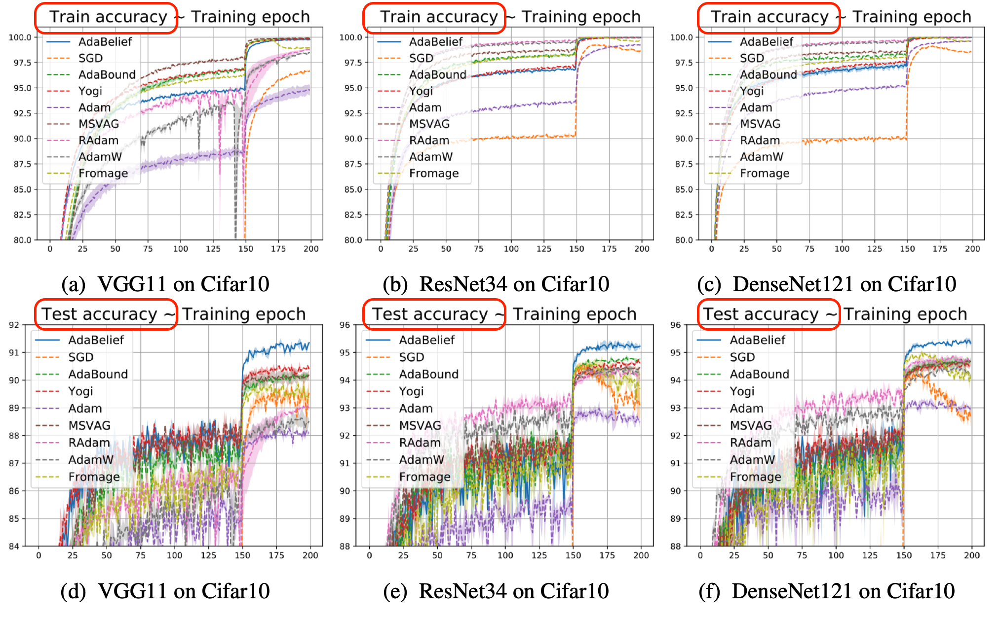
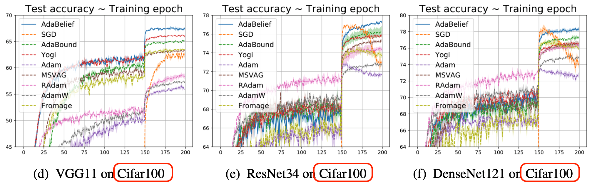
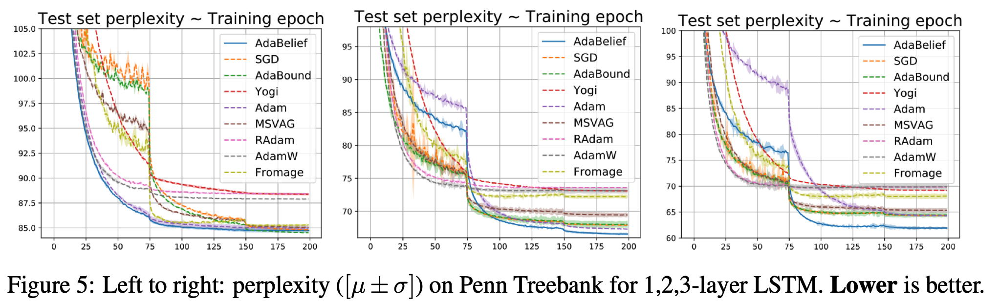
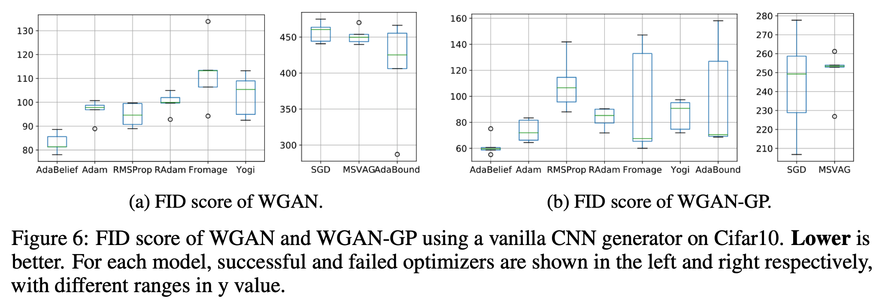
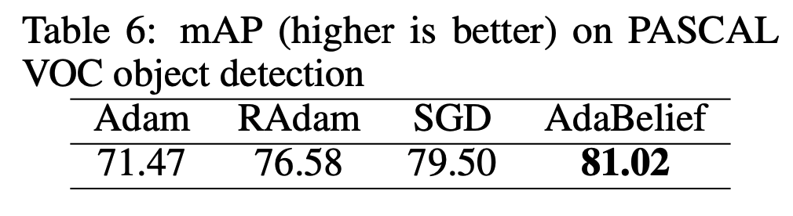

# AdaBelief Optimizer: Adapting Stepsizes by the Belief in Observed Gradients

---

## Introduction
- 최근 학습의 최적화 방법은 크게 두가지로 나뉨
  - The accelerated stochastic gradient descent (SGD) family
    - SGD, SGD + momentum, NAG, ...
    - 모든 파라미터에 global learning rate 사용
    - Generalization에서 우세, 느린 수렴
  - The adaptive learning rate methods
    - Adam, RMSProp, ...
    - 각 파라미터별로 다른 learning rate 사용
    - 빠른 수렴, SGD보다 Generalization에 약함

- 위 방법들을 개선한 방법들이 나오지만 여전히 SGD보다는 Generalization에 불리하거나 GAN에서 불안정함을 보임

- AdaBelief
  - 추가적인 파라미터 없이 Adam을 간단히 수정하여 구현 가능
  - AdaBelief 3요소
    - 빠른 수렴
    - SGD만큼 좋은 Generalization
    - GAN같은 복잡한 환경에서 학습 안정성(stability)

---

## Method

### Adam
- g_t의 EMA를 나타내는 m_t는 분자에 위치함. m_t가 크면, 올바른 방향으로 향하므로 large step 진행. m_t가 작으면 올바르지 않은 방향으로 판단해서 small step 진행(Momentum)
- g_t^2의 EMA로는 v_t로 표현하며 분모에 위치. 동일한 크기의 gradient update가 반대 방향으로 발생한다고 가정하면, m_t는 0에 가까워짐. 하지만 v_t는 큰 값을 갖음. 이러한 경우는 minimum으로 수렴한다고 할 수 없기 때문에 v_t가 커져 update율을 낮추는 효과. 반대로 v_t가 작을 때는 large step 진행(RMSProp)
- Adam은 위 두 특성을 합친 알고리즘

### AdaBelief
- Adam과 매우 유사하지만 v_t가 s_t로 변하였고, s_t는 (g_t - m_t)^2을 의미(gradient와 gradient EMA와의 제곱차)
- 위 의미는 gradient가 EMA와 유사하면 large step 진행하고, 다르면 small step 진행한다는 의미
 

|Region|내용|
|---|---|
|Region 1|(AdaBelief = Adam > SGD) gradient가 0에 가까움. 이상적인 step size는 커야하는데, SGD는 step 작게 진행. Adam, AdaBelief는 v_t, s_t가 작기 때문에 step size 크게 진행|
|Region 2|(AdaBelief = Adam > SGD) 수렴하기 위해 이상적인 step size는 작아야함. SGD는 m_t에 비례하므로 큰 step으로 진행. Adam이나 AdaBelief는 s_t, v_t가 커지기 때문에 작은 step로 진행|
|Region 3|(AdaBelief > SGD > Adam) AdaBelief가 Adam보다 좋은 것을 확인할 수 영역. Adam은 이 영역에서 곡선이 가파르기 때문에 g_t값이 커지는데, v_t값도 같이 커지기 때문에 step 크기는 작아짐(v_t(g_t^2의 EMA)가 분모) AdaBelief는 g_t와 m_t가 비슷한 값이 되고, 그러면 s_t가 작아지게되고 step의 크기가 커져 빠르게 수렴 가능|
 
- 아래 이미지는 AdaBelief의 장점을 직관적으로 표현
  - AdaBelief는 Adam에 비하여 s_x가 작으므로 x방향으로 더 빠르게 수렴

 

### 다양한 2차원 케이스에서 SGD, Adam, AdaBelief 수렴 방향 및 속도

---

## Experiments

### Image Classification

### LSTM on language modeling

### GAN

### Object detection

---

## Conclusion
- AdaBelief는 추가적인 파라미터 없이 파라미터 변경으로 구현 가능
- Convergence 속도와 Generalization 둘다 뛰어남
- "Belief"를 도입하여 step 크기 조절
- "Large gradient, small curvature" 조건의 Adam 약점을 해결